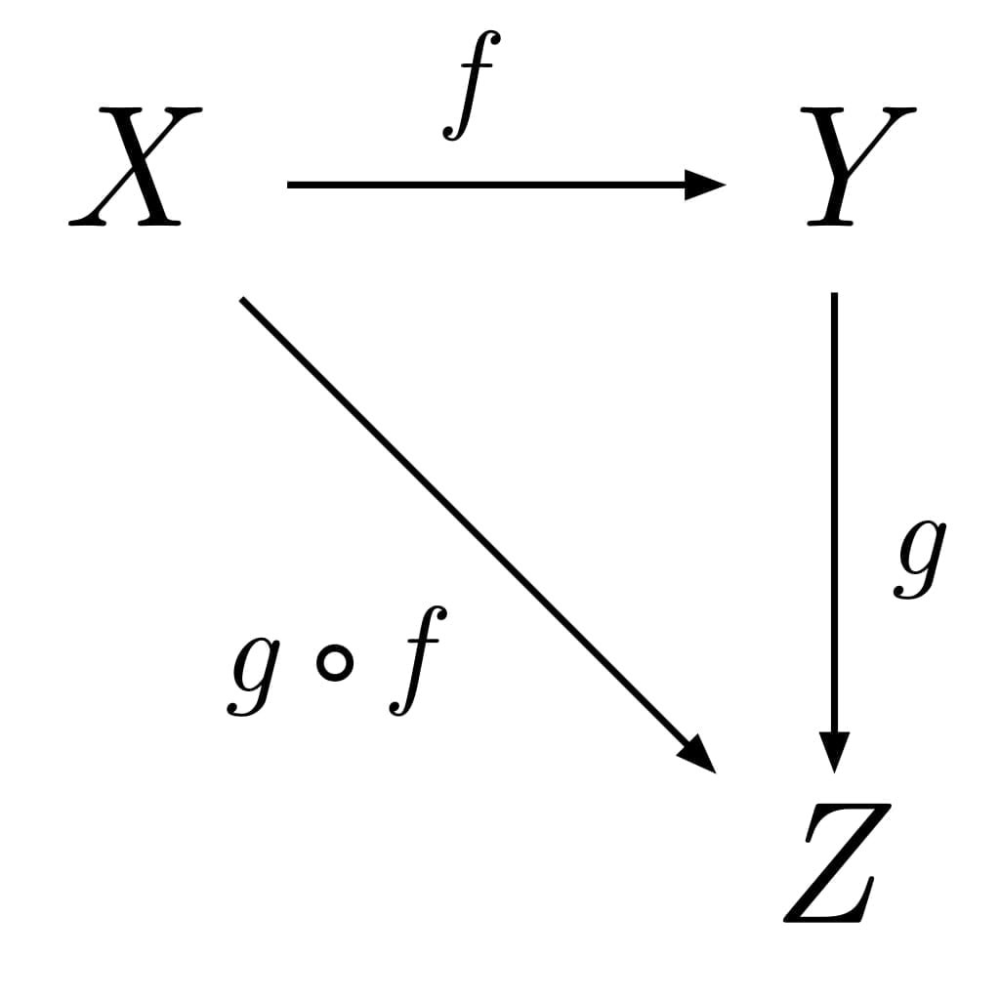
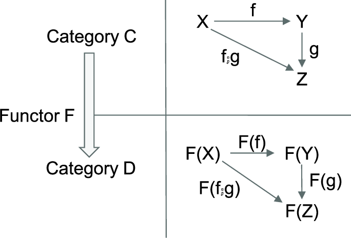

# Rust types and functions

Two of the main building blocks in Rust are functions and values. Values come in different
types, functions let you to convert between them. Not all functions are the same though, some
depend on the inputs only and only produce some resulting value, some - do something else.

Functions of first type are called pure and they are great - they are easy to work with, easy
to test, easy to reason about.

```rust
let a = 3;

fn inc(v: usize) -> usize [
    v + 1
}

let b = inc(a)
```

<!-- end_slide -->

# Pure functions, side effects

Functions compose - that is given two functions: from A to B and from B to C you can make a
function from A to C. We can think of a function as always taking a value in and always
producing a value. If it takes none - it's `()`, if it takes multiple values - it's a tuple.
Same with results - use tuples or `()`.



<!-- end_slide -->

# Parsers

Then there's parsers. A typical shape of a parser looks like this

```rust
Fn(I) -> Result<(I, T), Error>
```

```rust
Fn(&mut I) -> Result<T, Error>
```

First doesn't compose well, second - contains side effects. let's look into ways to manage
those effects.

<!-- end_slide -->

# Modeling side effects

We start with the easiest possible side effects - a computation that can fail. In Rust you'd
use `Option` or `Result` for that.

```rust
fn bad(i: Option<u8>) -> Option<u8> {
    match i {
        None => Some(42),
        Some(42) => Some(1),
        _ => None
    }
}
```

```rust
fn good(i: Option<u8>) -> Option<u8> {
    match i {
        None => None,
        Some(i) => Some(i + 3),
    }
}
```

They are both valid functions, but for "bad" case pure computation and effects are mixed
together, while in "good" one - effects are separate

<!-- end_slide -->

# Functor

Second function represents something called a `Functor`

Like pure functions Functors are also great. If you have something that obeys Functor laws -
you can plug any pure computation inside and it will just work, easy to test too. Rust comes
with a bunch of Functors: `Option::map`, `Result::map`. `Iterator<Item = A>::map` is also a
functor

Functor must preserve identity morphisms and compositions of morphisms:

`a.map(id) == a`, `a.map(f).map(g) == a.map(g . f)`. But that's just a complicated way of
saying - "don't throw away information and maintain the computation shape". In the previous
example "bad" throws away and invents stuff, "good" does great.

In general I'm going to use a notation `F<A>` for types and `map f` for arrows, where `F` is a
type or a trait concrete for this Functor, and `A` is some variable Functor knows nothing about
so it can only apply morphisms like `Fn(A) -> B` and nothing else



<!-- end_slide -->

# Applicative

Before I said we'll assume functions take a single argument and for multiple - we make a tuple.

Consider two values `A` and `B` and a function `f: Fn((A, B)) -> C` and think how corresponding
Functor might look like. A tuple is `(F<A>, F<B>)` and there's no corresponding pure
functions. Not good. We need to introduce one more bit of abstraction.

**Suppose `F` is a functor, then for two computations**
**`F<A>` and `F<B>` we can make `Fn((F<A>, F<B>)) -> F<(A, B)>`**

For `Option` this is `Option::zip`, for `Result`.... It can also be `zip`, as long as errors
agree, but for some reason it's missing. There's also `Iterator::zip` that does it for two
iterators. Same idea

[functor like category, `(A, B) -> C` on the left, `(F<A>, F<B>) -> F<(A, B)> -> F<C>` on the right]

<!-- end_slide -->

# Alternative

Getting somewhere. We know that the parser might fail so we must introduce some notion of
failure. For `Option` this is `None`, for `Result` this is `Err`.

We can add two functions to our abstract interface

```
pure: Fn(T) -> F<T>
fail: Fn(E) -> F<T>
```

And now that we know that some computation can fail - we want something to be able to try
several of them

```rust
alt: Fn(F<T>, F<T>) -> F<T>
```

In Rust this is `Option::or` and `Result::or` (and their variants)

<!-- end_slide -->

# Making a simple parser

Now that we have all the basic methods we can look into making something with the parser

```rust
map: Fn(F<A>, Fn(A) -> B) -> F<B>
zip: Fn(F<A>, F<B>) -> F<(A, B)>
pure: Fn(A) -> F<A>
fail: Fn(E) -> F<A>
alt: Fn(F<A>, F<A>) -> F<A>
```

It doesn't matter which version of the parser we begin with -

```rust
Fn(I) -> Result<(I, T), Error> = ...
Fn(&mut I) -> Result<T, Error> = ...
```

```rust
struct Parser<T>(Box<Fn(&mut Args)> -> Result<T, Error>);
```

```rust
trait Parser<A> {
    fn map(self, impl Fn(A) -> B) -> impl Parser<B> {..}
    fn zip(self, other: impl Parser<B>) -> impl Parser<(A, B)> {..}
   ...
}
```

<!-- end_slide -->

# Methods we can implement

```rust
trait Parser<A> {
    // Required to compose

    fn map(self, f: impl Fn(F<A>, Fn(A) -> B) -> impl Parser<B> {..}
    fn zip(self, other: impl Parser<B>) -> impl Parser<(A, B)> {..}
    fn pure(val: A) -> impl Parser<A> {..}
    fn fail(message: &'static str) -> impl Parser<A> {..}
    fn alt(self, other: impl Parser<A>) -> impl Parser<A> {..}

    // Convenience
    fn optional(self) -> impl Parser<Option<A>> {..}
    fn many(self) -> impl Parser<Vec<A>> {..}
    fn some(self, error: &'static str) -> impl Parser<Vec<A>> {..}
    fn collect<C: FromIterator<A>>(self) -> impl Parser<C> {..}
    fn parse(self, impl Fn(A) -> Result<B, E>) -> impl Parser<B> {..}

    // Required to run
    fn run(self) -> A {..}
}
```

<!-- end_slide -->

# dynamic completionm

- Easy to implement

# Conclusions

- High level overview of your app/API
- Composing with CT reduces number of combinations from N^2 to N
- Users don't have to know about it :)

# See also

- https://rustmagazine.org/issue-2/applicative-parsing/
- https://en.wikipedia.org/wiki/Category_theory
- https://crates.io/crates/bpaf
- https://github.com/pacak
- @manpacket@functional.cafe
